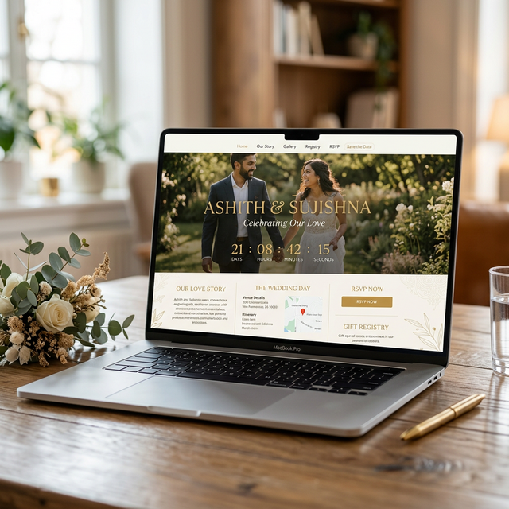

# 💍 Ashith & Sujishna | Wedding Invitation

<div align="center">
  
</div>

Welcome to the repository for our wedding website! We are super excited to invite you to celebrate our special day with us on **May 3rd, 2026**.

## 🌟 Key Features

- **Beautiful Responsive Layout:** A highly professional, mobile-first design that adapts perfectly to desktop, tablet, and smartphone screens.
- **Countdown Timer:** A custom live countdown timer building excitement up to the wedding date.
- **Event Information:** Elegant location cards for both the Wedding (Shaa International) and Reception (Jubily Hall) with single-click "Map" links.
- **QR Code Generation:** Integrated popup modal that generates dynamic QR codes on-the-spot for easy scanning and mobile directions.
- **Save the Date:** Immediate integration into Google Calendar with a one-click "Add to Calendar" button.
- **Background Ambiance:** A beautiful audio player toggle that manages background music alongside browser policies.
- **Photo Gallery:** A subtle, animated memory grid highlighting favorite moments.

## 🚀 Hosting & Live Link
You can access the live website here: *(Link to your live GitHub Pages or Vercel site here!)*

## 🛠️ Built With
- **HTML5** & **Vanilla CSS** (Animations, Custom Variables, Glassmorphism)
- **Vanilla JavaScript** 
- **QRCode.js** 
- **Google Fonts** (Cormorant Garamond & Montserrat)
- **Font Awesome**

## 💻 Local Setup
1. Clone the repository:
   ```bash
   git clone https://github.com/ashith-ka/ashith-sujishna.git
   ```
2. To run locally, simply open the `index.html` file in any modern browser or utilize a fast local server (like the VSCode Live Server Extension).

---
*Made with love in anticipation of May 3rd, 2026!*
